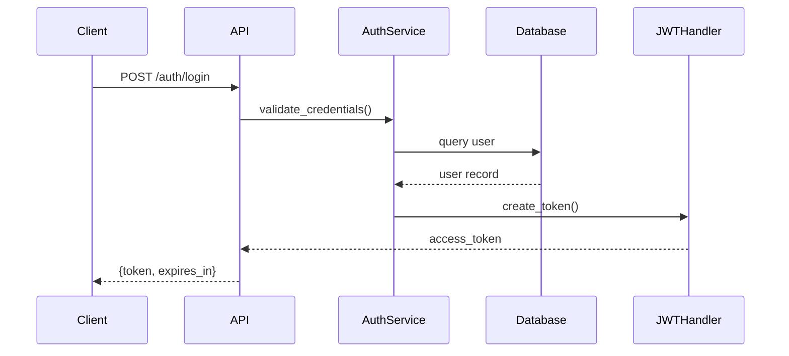

# PRP Best Practices - December 2025

Current recommendations for building effective PRPs, categorized by necessity level.

---

## Essential (Must Have)

These are non-negotiable. Without them, PRPs fail.

### 1. Executable Acceptance Criteria

**What:** Every PRP must have verifiable completion conditions.

**Why:** Agents cannot self-assess "good enough." They need binary pass/fail checks.

**How:**
```markdown
## Success Criteria
- [ ] `pytest tests/feature/ -v` passes (0 failures)
- [ ] `ruff check src/feature/` returns 0 errors
- [ ] `curl localhost:8000/api/feature/health` returns `{"status": "ok"}`
- [ ] New endpoint documented in `docs/openapi.yaml`
```

**Not This:**
```markdown
## Success Criteria
- Feature works correctly
- Code is clean
- Tests are comprehensive
```

---

### 2. Specific File References

**What:** Every file mentioned includes path from project root.

**Why:** "The auth module" could be 5 different files. Specificity saves tokens.

**How:**
```markdown
## Context
- Primary file: `src/services/auth/jwt_handler.py`
- Test file: `tests/unit/services/test_jwt_handler.py`
- Pattern: `src/services/users/user_service.py:45-67`
```

**Not This:**
```markdown
## Context
- The JWT handler
- Related test file
- Follow the user service pattern
```

---

### 3. Immediate Validation After Tasks

**What:** Each task ends with a runnable validation command.

**Why:** Catch errors before they compound. Faster feedback = better results.

**How:**
```markdown
### Task 2: ADD authentication middleware
- IMPLEMENT: JWT verification
- VALIDATE: `pytest tests/middleware/test_auth.py -v && ruff check src/middleware/`
- IF_FAIL: Check JWT_SECRET env, verify pyjwt installed
```

---

### 4. Pattern References Over Descriptions

**What:** Point to existing code instead of describing conventions.

**Why:** "Follow this file" is unambiguous. Descriptions get misinterpreted.

**How:**
```markdown
- PATTERN: `src/api/routes/users.py:20-45` (route structure)
- PATTERN: `src/schemas/user.py` (Pydantic model style)
- PATTERN: `tests/api/test_users.py` (test organization)
```

**Not This:**
```markdown
- Use RESTful conventions
- Follow our standard Pydantic patterns
- Write tests like we usually do
```

---

## Recommended (Should Have)

These significantly improve PRP quality but aren't strictly required.

### 5. Context Completeness Check

**What:** A self-validation section asking if implementation could proceed without codebase access.

**Why:** Forces you to include everything needed. Reveals gaps before execution.

**How:**
```markdown
## Context Completeness Check

Could another developer implement this using ONLY this PRP?

| Requirement | Specified? | Location in PRP |
|-------------|------------|-----------------|
| All file paths | ✓ | Context section |
| Dependencies | ✓ | Setup tasks |
| Patterns to follow | ✓ | Each task |
| Known gotchas | ✓ | Gotchas section |
| Validation commands | ✓ | Each task |

If any row is missing, add it before proceeding.
```

---

### 6. Gotcha Documentation

**What:** Non-obvious constraints, library quirks, project-specific rules.

**Why:** Prevents repeating mistakes. Encodes tribal knowledge.

**How:**
```markdown
## Known Gotchas

### Library Constraints
- **pydantic v2**: Use `model_validate()` not `parse_obj()` (deprecated)
- **SQLAlchemy 2.0**: Async sessions require `async_sessionmaker`
- **FastAPI**: `Depends` with `yield` must handle cleanup in finally block

### Project-Specific
- All API responses wrapped in `{"data": ..., "meta": {...}}`
- Database connections pooled - never create new engines
- Tests use `TEST_` prefix env vars, not mocks
```

---

### 7. Codebase Trees

**What:** Visual representation of current and desired file structure.

**Why:** Clarifies scope. Shows what's new vs modified.

**How:**
```markdown
## Codebase Structure

### Current State
```
src/
├── services/
│   └── user_service.py
├── api/
│   └── routes/
│       └── users.py
└── models/
    └── user.py
```

### After Implementation
```
src/
├── services/
│   ├── user_service.py
│   └── auth_service.py  # NEW
├── api/
│   └── routes/
│       ├── users.py
│       └── auth.py      # NEW
├── models/
│   ├── user.py
│   └── token.py         # NEW
└── middleware/
    └── jwt_auth.py      # NEW
```
```

---

### 8. Four-Level Validation

**What:** Structured validation at syntax, unit, integration, and domain levels.

**Why:** Different issues caught at different stages. Comprehensive coverage.

**How:**
```markdown
## Validation Framework

### Level 1 - Syntax
`ruff check src/auth/ && mypy src/auth/`

### Level 2 - Unit
`pytest tests/unit/auth/ -v --cov=src/auth`

### Level 3 - Integration
`docker-compose up -d && pytest tests/integration/auth/ -v`

### Level 4 - Domain
`pytest tests/performance/test_auth_load.py --benchmark-only`
```

---

## Optional (Nice to Have)

Include when they add value for specific situations.

### 9. Mermaid Diagrams

**When:** Complex flows, multi-service interactions, state machines.

**How:**
```markdown
## Flow Diagram


```

**Skip When:** Simple CRUD, single-file changes, obvious flows.

---

### 10. Alternative Approaches

**When:** Genuine trade-offs exist, user should decide.

**How:**
```markdown
## Approach Options

### Option A: Session-based Auth
- Pros: Simple, built-in CSRF protection
- Cons: Requires sticky sessions for scaling
- Effort: Lower

### Option B: JWT Auth
- Pros: Stateless, scales horizontally
- Cons: Token revocation complexity
- Effort: Higher

**Recommendation:** Option B for API-first architecture.
```

**Skip When:** One obvious approach, no meaningful trade-offs.

---

### 11. Performance Benchmarks

**When:** Performance-critical features, optimization work.

**How:**
```markdown
## Performance Requirements

| Operation | Current | Target | Method |
|-----------|---------|--------|--------|
| Token generation | 15ms | <10ms | `pytest --benchmark` |
| Token validation | 5ms | <2ms | `pytest --benchmark` |
| Auth middleware | 8ms overhead | <5ms | `k6 load test` |
```

**Skip When:** Standard CRUD, non-critical paths.

---

## Overkill (Skip Unless Explicitly Needed)

These add complexity without proportional value for most PRPs.

### 12. Exhaustive Edge Cases

**Overkill:**
```markdown
## Edge Cases
- Empty string email
- Email with unicode
- Email exactly 255 chars
- Email with +alias
- Email with subdomain
- Email with IP domain
- [... 30 more edge cases]
```

**Better:** Cover common cases, add edge cases when bugs surface.
```markdown
## Key Edge Cases
- Invalid email format → 400 with validation error
- Duplicate email → 409 conflict
- Rate limited → 429 with retry-after header
```

---

### 13. Multi-Phase Migration Plans

**Overkill for most PRPs:**
```markdown
## Phase 1 (Week 1-2): Database schema migration
## Phase 2 (Week 3-4): Dual-write implementation
## Phase 3 (Week 5-6): Read migration
## Phase 4 (Week 7-8): Cleanup and deprecation
```

**When Actually Needed:** Production systems with zero-downtime requirements, massive data migrations.

**Better Default:** Single-phase implementation with clear rollback.

---

### 14. External Stakeholder Sections

**Overkill:**
```markdown
## Stakeholder Communication
- Product: Weekly sync on feature progress
- Design: Review UI components
- Legal: Privacy policy update
- Marketing: Feature announcement prep
```

**PRPs are developer-focused.** Keep stakeholder coordination in project management tools.

---

### 15. Comprehensive Risk Matrices

**Overkill:**
```markdown
## Risk Assessment

| Risk | Probability | Impact | Mitigation | Owner | Status |
|------|-------------|--------|------------|-------|--------|
[... 20 row matrix]
```

**Better:** Simple gotchas section covering technical risks.

---

## 2025 Trends Applied

### Context Engineering Integration
- **Progressive disclosure:** Load templates/references only when needed
- **Token budget awareness:** Keep PRPs concise; aim for 2000 tokens for Story PRPs
- **Attention positioning:** Critical info at start/end of sections

### Agent-Native Design
- **Executable specifications:** Everything validatable by commands
- **Self-contained context:** No assumptions about agent memory
- **Explicit dependencies:** Never rely on implicit ordering

### Quality Gates
- **Shift-left validation:** Validate at each task, not just at the end
- **IF_FAIL hints:** Debug guidance prevents loops
- **Four-level coverage:** Appropriate validation at each stage

---

## Quick Decision Matrix

| Situation | Include |
|-----------|---------|
| Any PRP | Essential items (1-4) |
| Medium+ scope | + Recommended items (5-8) |
| Complex flows | + Diagrams (9) |
| Trade-off decisions | + Alternatives (10) |
| Performance work | + Benchmarks (11) |
| Enterprise/regulated | + Extended edge cases, risk matrices |
| Simple task | Essential only, skip everything else |
