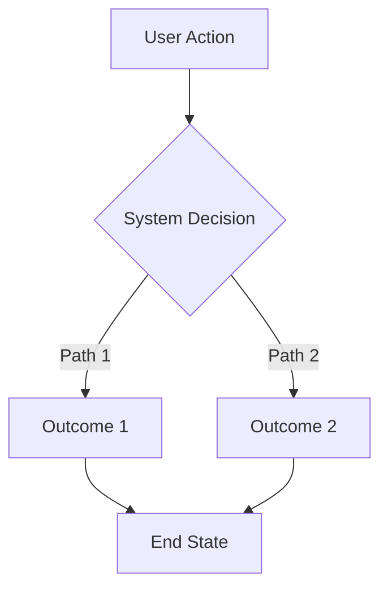
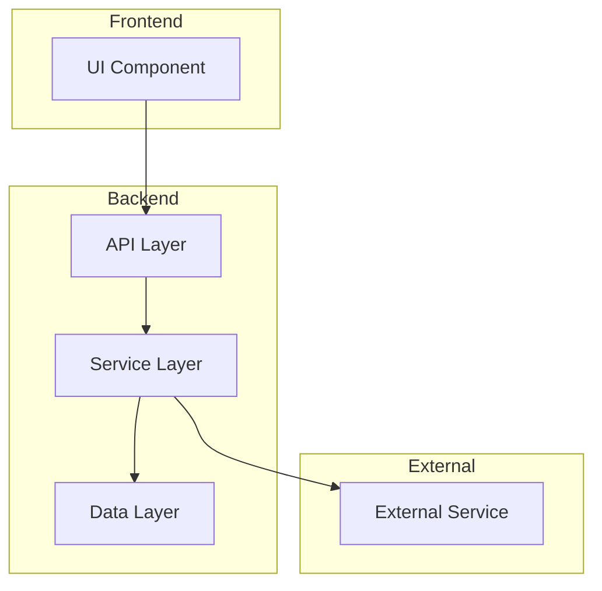
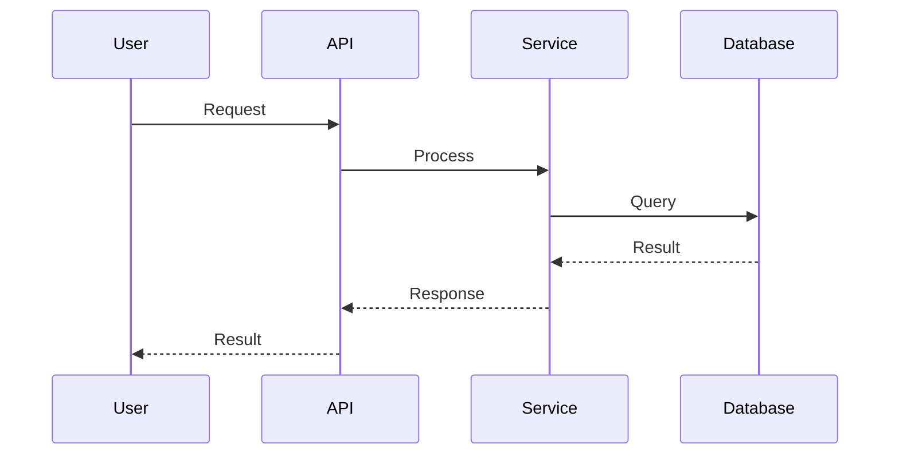
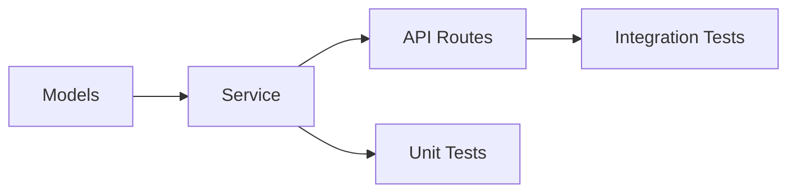

# Planning PRP Template

Research-first template for complex features requiring exploration before specification.

---

## Feature: [TITLE]

> [Initial concept description - will be refined through research]

### Planning Scope
- **Phase:** Research & specification (no implementation)
- **Output:** Implementation-ready Base PRP or Story PRPs
- **Complexity:** Unknown → will be assessed

---

# Phase 1: Idea Expansion & Research

## 1.1 Context Gathering

### Market Analysis
```yaml
research_queries:
  - query: "[competitor] [feature] implementation"
    goal: "Understand existing solutions"
  - query: "[problem] best practices [year]"
    goal: "Current industry standards"
  - query: "[domain] common pitfalls"
    goal: "Avoid known mistakes"

findings:
  competitors:
    - name: "[Competitor 1]"
      approach: "[How they solve this]"
      pros: "[What works]"
      cons: "[What doesn't]"

  industry_standards:
    - standard: "[Standard/pattern name]"
      adoption: "[How widely used]"
      relevance: "[Why it matters for us]"
```

### Technical Research
```yaml
research_queries:
  - query: "[technology] [feature] tutorial"
    goal: "Implementation approaches"
  - query: "[framework] [pattern] example"
    goal: "Code patterns"
  - query: "[library] vs [alternative] comparison"
    goal: "Technology selection"

findings:
  implementation_options:
    - option: "[Approach A]"
      technology: "[Stack/libraries]"
      complexity: "low|medium|high"
      trade_offs: "[Pros and cons]"

    - option: "[Approach B]"
      technology: "[Stack/libraries]"
      complexity: "low|medium|high"
      trade_offs: "[Pros and cons]"

  recommended_libraries:
    - name: "[library]"
      version: "[version]"
      reason: "[Why this choice]"
      gotchas: "[Known issues]"
```

### Internal Context
```yaml
codebase_analysis:
  - query: "rg '[related_pattern]' --type py"
    goal: "Find existing similar implementations"

  - query: "fd -e py | xargs grep -l '[related_term]'"
    goal: "Locate relevant modules"

findings:
  existing_patterns:
    - file: "path/to/file.py:LINES"
      pattern: "[What it demonstrates]"
      reusable: "yes|no|partial"

  integration_points:
    - system: "[Existing system]"
      interface: "[How to connect]"
      constraints: "[Limitations]"

  technical_debt:
    - issue: "[Existing problem]"
      impact: "[How it affects this feature]"
      mitigation: "[How to handle]"
```

---

## 1.2 Research Summary

### Key Insights
1. [Insight 1 from research]
2. [Insight 2 from research]
3. [Insight 3 from research]

### Recommended Approach
[2-3 sentences on chosen direction based on research]

### Open Questions
- [ ] [Question that needs stakeholder input]
- [ ] [Technical question to resolve]
- [ ] [Scope question to clarify]

---

# Phase 2: PRD Structure

## 2.1 Executive Summary

### Problem Statement
[Clear articulation of the problem being solved]

### Solution Overview
[High-level description of the solution]

### Success Metrics
| Metric | Current | Target | Measurement |
|--------|---------|--------|-------------|
| [Metric 1] | [baseline] | [goal] | [how measured] |
| [Metric 2] | [baseline] | [goal] | [how measured] |

---

## 2.2 User Stories & Scenarios

### Primary User Story
```
As a [user type],
I want to [action],
So that [benefit].
```

### User Flow Diagram


### Acceptance Criteria
```gherkin
Feature: [Feature name]

Scenario: [Happy path]
  Given [precondition]
  When [action]
  Then [outcome]

Scenario: [Edge case 1]
  Given [precondition]
  When [action]
  Then [outcome]

Scenario: [Error case]
  Given [precondition]
  When [invalid action]
  Then [error handling]
```

---

## 2.3 System Architecture

### Component Diagram


### Component Responsibilities
| Component | Responsibility | Technology |
|-----------|---------------|------------|
| [Component 1] | [What it does] | [Stack] |
| [Component 2] | [What it does] | [Stack] |
| [Component 3] | [What it does] | [Stack] |

---

## 2.4 Technical Specifications

### API Design
```yaml
endpoints:
  - path: "/api/v1/[resource]"
    method: "POST"
    description: "[What it does]"
    request:
      body:
        field1: "type"
        field2: "type"
    response:
      success:
        status: 201
        body: "{id, field1, created_at}"
      errors:
        - status: 400
          condition: "Invalid input"
        - status: 409
          condition: "Conflict"
```

### Data Flow Diagram


### Data Models
```yaml
models:
  NewEntity:
    fields:
      - name: "id"
        type: "UUID"
        constraints: "primary key"
      - name: "field1"
        type: "String"
        constraints: "required, max 255"
    indexes:
      - fields: ["field1"]
        type: "btree"
    relations:
      - to: "ExistingEntity"
        type: "many-to-one"
```

---

## 2.5 Implementation Strategy

### Phase Breakdown
```yaml
phases:
  - name: "Phase 1: Foundation"
    priority: "P0"
    scope:
      - "Data models"
      - "Core service logic"
    deliverable: "Working backend, no UI"

  - name: "Phase 2: API"
    priority: "P0"
    scope:
      - "REST endpoints"
      - "Validation"
    deliverable: "Functional API"
    depends_on: "Phase 1"

  - name: "Phase 3: Integration"
    priority: "P1"
    scope:
      - "Frontend integration"
      - "E2E tests"
    deliverable: "Complete feature"
    depends_on: "Phase 2"
```

### Dependency Graph


---

# Phase 3: Challenge & Validation

## 3.1 Risk Analysis

### Technical Risks
| Risk | Probability | Impact | Mitigation |
|------|-------------|--------|------------|
| [Risk 1] | Low/Med/High | Low/Med/High | [Strategy] |
| [Risk 2] | Low/Med/High | Low/Med/High | [Strategy] |

### Business Risks
| Risk | Probability | Impact | Mitigation |
|------|-------------|--------|------------|
| [Risk 1] | Low/Med/High | Low/Med/High | [Strategy] |

---

## 3.2 Edge Cases

### Identified Edge Cases
```yaml
edge_cases:
  - scenario: "[Edge case 1]"
    handling: "[How to handle]"
    test: "[How to verify]"

  - scenario: "[Edge case 2]"
    handling: "[How to handle]"
    test: "[How to verify]"

  - scenario: "[Concurrent access]"
    handling: "[Locking/versioning strategy]"
    test: "[Concurrency test approach]"
```

### Failure Modes
```yaml
failure_modes:
  - mode: "[External service down]"
    detection: "[How we know]"
    recovery: "[What happens]"
    user_impact: "[What user sees]"

  - mode: "[Database connection lost]"
    detection: "[Health check]"
    recovery: "[Reconnection strategy]"
    user_impact: "[Error message]"
```

---

## 3.3 Success Criteria

### Definition of Done
- [ ] All acceptance criteria pass
- [ ] Unit test coverage >80%
- [ ] Integration tests pass
- [ ] API documentation complete
- [ ] No P0/P1 bugs
- [ ] Performance within targets
- [ ] Security review passed

### Validation Plan
```yaml
validation:
  - type: "Unit tests"
    coverage: ">80%"
    command: "pytest tests/unit/ -v --cov"

  - type: "Integration tests"
    scope: "All endpoints"
    command: "pytest tests/integration/ -v"

  - type: "Performance"
    metric: "p95 latency"
    target: "<200ms"
    command: "k6 run scripts/load_test.js"

  - type: "Security"
    scope: "New code"
    command: "bandit -r src/[feature]/"
```

---

# Phase 4: Output & Handoff

## 4.1 Generated Artifacts

### For Implementation
- [ ] Base PRP or Story PRPs generated
- [ ] Task breakdown complete
- [ ] Validation commands specified
- [ ] Patterns referenced

### Documentation
- [ ] Architecture diagram finalized
- [ ] API specification complete
- [ ] Data model documented

---

## 4.2 Recommendations

### Approach Selection
**Recommended:** [Chosen approach]
**Rationale:** [Why this approach]
**Trade-offs accepted:** [What we're giving up]

### Implementation Order
1. [First thing to build]
2. [Second thing]
3. [Third thing]

### Team Considerations
- **Skills needed:** [Required expertise]
- **Dependencies:** [External blockers]
- **Risks to monitor:** [Key concerns]

---

## 4.3 Next Steps

### Immediate
- [ ] Review this planning document
- [ ] Resolve open questions
- [ ] Approve approach

### After Approval
- [ ] Generate implementation PRPs
- [ ] Create development branch
- [ ] Begin Phase 1 implementation

---

# Template Usage Notes

## When to Use Planning PRP

Use this template when:
- Feature scope is unclear
- Multiple valid approaches exist
- Stakeholder alignment needed
- New technology being evaluated
- Cross-team coordination required

## Output Expectations

This template produces:
1. Research findings (Phase 1)
2. Technical specification (Phase 2)
3. Risk assessment (Phase 3)
4. Implementation-ready PRPs (Phase 4)

## Time Investment

Expect to spend:
- Phase 1: 20-30% of planning time
- Phase 2: 40-50% of planning time
- Phase 3: 15-20% of planning time
- Phase 4: 10-15% of planning time
